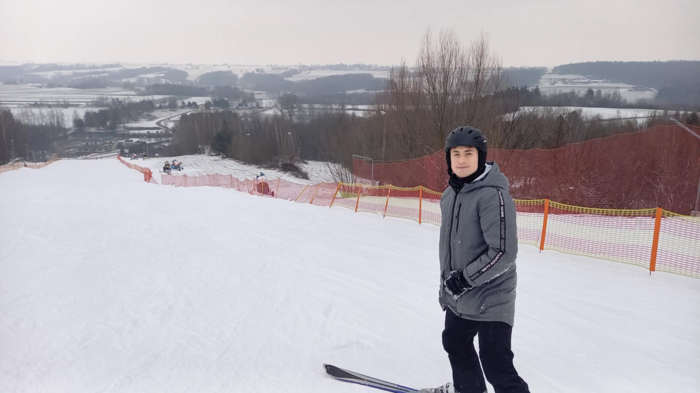

---
# Feel free to add content and custom Front Matter to this file.
# To modify the layout, see https://jekyllrb.com/docs/themes/#overriding-theme-defaults

layout: home
title: "Home"
---
# Welcome to my page!
My name is Daniel and currently I am studying at third year on Cracow University of Technology. I can speak Polish, English (C1) and a little Italian (currently learning at A1 level)

I'm interested in social mechanisms, music, IT and computer games 😛
In IT I like a lot of things: programming, repairing stuff and managing servers (at this moment I have 2! running on Proxmox and RHEL).
  

*At hillside on Konary, Poland*
## Technology stack


I also like React and Jekyll (which is powering my site)!
## Career
- **July 2019** - Intern at System Data Sp. z o.o.
- **April 2015** - present: Freelance work within the framework of unregistered business activity Mainly worked as IT service technician/support/graphics.

## Projects and others
I have more content on my page! Go to my subpages to download some files or read about my projects.
Have a great day!:)
